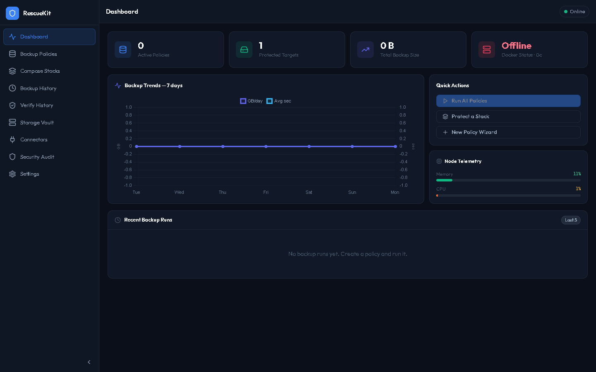

# DockerRescueKit

**Automated backup and restore for Docker containers, volumes, images, and networks.**

[](https://github.com/gozippy/DockerRescueKit/actions)
[](LICENSE)
[](https://hub.docker.com/r/gozippy/dockerrescuekit)

DockerRescueKit is a self-hosted backup service for Docker. It runs as a
single container next to your Docker daemon, discovers your containers
and volumes through the Docker API, and snapshots them on a schedule to
the storage backend of your choice. Recoveries — full or partial — are
driven by the same service through a REST API, a web UI, and a CLI.


---

## Why

- **Container-aware backups.** Snapshots containers, volumes, images, and
  networks together as a coherent unit, not just arbitrary filesystem
  paths. Restore brings the whole stack back, not a tarball you have to
  unpack yourself.
- **Seven pluggable storage backends.** Local filesystem, SMB/CIFS,
  SFTP, S3-compatible object storage, Proxmox Backup Server, restic
  repos, and rclone (~40 cloud providers). Credentials are encrypted at
  rest with AES-256-GCM.
- **Policy-driven scheduler with retention and verify.** Cron-based
  policies, tiered retention (count, time, or daily/weekly/monthly tags),
  background verify in a scratch container, and partial restore down to
  individual files inside a volume.

---

## Quick Start

```bash
git clone https://github.com/gozippy/DockerRescueKit.git
cd DockerRescueKit
docker compose up -d
```

Verify the service is up:

```bash
curl http://localhost:42880/healthz
# → {"status":"ok","uptime":12.3}
```

Open the web UI at [http://localhost:42880](http://localhost:42880).
The compose file at the repo root publishes the service on port `42880`
and mounts the Docker socket so DRK can see your containers.

---

## First-Run Setup

On the first start, DockerRescueKit generates a random API key and a
random encryption key, then persists both to `$DRK_DATA_DIR/secrets.json`
(inside the container that resolves to `/data/secrets.json`, which is
backed by the named volume `drk-data`).

Retrieve the API key:

```bash
docker exec drk cat /data/secrets.json
# → {"apiKey":"<your-generated-key>","encryptionKey":"<encryption-key>"}
```

Then call any authenticated endpoint with that key:

```bash
KEY=$(docker exec drk cat /data/secrets.json | jq -r .apiKey)

curl -H "x-api-key: $KEY" http://localhost:42880/api/status
# → {"status":"online","version":"1.0.0","docker":true,...}
```

To pre-seed your own keys instead of letting the service generate them,
set `DRK_API_KEY` and `DRK_ENCRYPTION_KEY` in `docker-compose.yml`
before the first start. The API key can also be regenerated at any time
from the Settings panel in the web UI — no restart required.

> **Warning:** rotating `DRK_ENCRYPTION_KEY` after the fact will
> invalidate every credential stored in the vault. Only the API key
> rotates safely.

---

## Screenshots

| Policies | Settings |
|---|---|
|  |  |

---

## Features

- **Backups** — containers, volumes, images, and networks captured as a
  consistent unit. Pre- and post-backup hooks executed inside the target
  container via `docker exec`.
- **Storage adapters** — Local, SMB/CIFS, SFTP, S3, Proxmox Backup
  Server, restic, rclone. All credentials AES-256-GCM encrypted at rest.
- **Scheduling** — cron-based policies with `node-cron` semantics. Pause
  and resume the global scheduler without losing schedule state. Per-run
  audit log of every policy invocation.
- **Retention** — simple count, time-based, or tiered
  (daily/weekly/monthly) retention with safe deletion that runs after
  the write completes.
- **Verify and restore** — every backup can be restore-tested in a
  scratch container before you trust it. Full-stack restore or partial
  restore down to individual files (browse and extract).
- **CLI** — `drk` command with policy, backup, connector, and rclone
  subcommands. Talks to the same REST API the UI uses.
- **Web UI** — bundled React app served by the backend on the same port.
  Policy editor, backup history, restore wizard, connector setup,
  settings panel.
- **Observability** — unauthenticated `GET /healthz` for liveness probes
  and `GET /metrics` in Prometheus exposition format. Every request gets
  an `X-Request-Id` correlation header that flows through to logs and
  error responses.

---

## Architecture

The service is a single Node.js process serving a React UI, a REST API,
a cron scheduler, and the storage adapters from one container. See
[`docs/ARCHITECTURE.md`](docs/ARCHITECTURE.md) for the component diagram
and data flow. For sizing across homelab, small business, and
enterprise deployments, see [`docs/DEPLOYMENT_BY_TIER.md`](docs/DEPLOYMENT_BY_TIER.md).

---

## Docker Desktop Extension

DockerRescueKit currently ships as a standalone container. A native
Docker Desktop extension that embeds the same UI inside Docker Desktop
is on the **v1.1 roadmap**. The extension UI bundle is already built
and served by the backend at `/`, so today's experience is functionally
equivalent — you just navigate to `http://localhost:42880` in your
browser instead of opening Docker Desktop.

---

## DOCKER_GID — Important for Linux and macOS Hosts

The DRK container talks to your Docker daemon through
`/var/run/docker.sock`. The non-root user inside the container can only
read the socket if it shares the host's `docker` group GID.

- Most Linux distros use **gid 999** — the compose file defaults to this.
- **Synology / QNAP** typically use **gid 100**.
- Some Debian variants use **gid 998**.
- macOS / Docker Desktop expose the socket differently and usually do
  not require this setting.

Find your host's docker group GID:

```bash
getent group docker | cut -d: -f3
# → 999
```

Pass the correct value when starting the service:

```bash
DOCKER_GID=100 docker compose up -d
```

If the GID is wrong, the `/api/docker` endpoints return offline and
container discovery silently produces an empty list.

---

## Configuration

All configuration is via environment variables read by the backend on
startup.

| Variable             | Default                     | Notes                                                                 |
| -------------------- | --------------------------- | --------------------------------------------------------------------- |
| `DRK_DATA_DIR`       | `/data`                     | Path inside the container holding the SQLite DB, secrets, and staging.|
| `PORT`               | `42880`                     | HTTP listen port for the API + UI.                                    |
| `DRK_API_KEY`        | *auto-generated*            | Pre-seed an API key. Otherwise one is generated and written to `secrets.json` on first start. |
| `DRK_ENCRYPTION_KEY` | *auto-generated*            | Master AES-256-GCM key for the credential vault. Do not rotate after first start. |
| `DOCKER_GID`         | `999` (compose `group_add`) | Host docker-group GID granted to the in-container `drk` user.         |
| `DB_PATH`            | `$DRK_DATA_DIR/docker_rescue.db` | Override the SQLite DB location (rarely needed).                 |
| `NODE_ENV`           | `production`                | Standard Node.js mode flag.                                           |
| `RESTIC_BIN`         | `restic`                    | Override path to the restic binary. The image ships one preinstalled. |
| `RCLONE_BIN`         | `rclone`                    | Override path to the rclone binary. The image ships one preinstalled. |
| `PBS_BIN`            | `proxmox-backup-client`     | Override path to the PBS client.                                      |

Rate limits are currently fixed in code: **100 requests per 15 minutes
per IP** against `/api/*`, plus a **10 failed-auth requests per minute**
brute-force throttle. Both layers emit standard `RateLimit-*` headers.

---

## CLI

The `drk` CLI lives in [`packages/cli`](packages/cli) and is installed
as a bin entry by that package. It talks to the same REST API as the UI
and reads `DRK_URL` (default `http://localhost:42880`) and `DRK_API_KEY`
from the environment.

```text
drk — Docker Rescue Kit CLI

Usage:  drk <command> [arguments] [--flags]

Environment:
  DRK_URL       API base URL (default: http://localhost:42880)
  DRK_API_KEY   API key (required)

Service
  status                Show service, scheduler, and Docker connection status
  scheduler:pause       Stop firing scheduled policy runs
  scheduler:resume      Resume the scheduler

Policies
  policy:list           List all backup policies
  policy:show           Show a single policy
  policy:run            Trigger a policy run now
  policy:delete         Delete a policy
  policy:history        List recent runs for a policy

Backups
  backup:list           List backups (optionally filtered by policy)
  backup:show           Show a single backup
  backup:restore        Restore a backup (full or partial)
  backup:verify         Verify a backup in a scratch container
  backup:delete         Delete a backup
  backup:files          List or extract files inside a backup

Docker
  stacks                List compose stacks visible to the daemon
  volumes               List Docker volumes
  images                List Docker images
  networks              List Docker networks
  stack:protect         Add a compose stack to a backup policy

Connectors
  connectors:list       List configured storage connectors
  connectors:definitions  Show available connector types
  connectors:test       Test a connector's credentials
  connectors:delete     Remove a connector

Rclone
  rclone:providers      List supported rclone provider types
  rclone:list           List configured rclone remotes
  rclone:add            Add a new rclone remote
  rclone:delete         Remove an rclone remote
  rclone:test           Test an rclone remote

Audit & Settings
  audit                 Show recent audit log entries
  settings:show         Show current settings
  verify:history        Show recent verify-run results
```

---

## Development

See [`docs/DEVELOPMENT.md`](docs/DEVELOPMENT.md) for the monorepo layout,
build commands, and how to run the backend and extension UI with hot
reload. Contributions welcome — see [`CONTRIBUTING.md`](CONTRIBUTING.md).

---

## License

MIT — see [LICENSE](LICENSE).

---

## Legacy WSL / Docker Desktop Tools

Older PowerShell tooling for WSL2 distro patching and Docker Desktop
image maintenance still ships in `tools/` and at the repo root
(`backup-docker-snapshot.ps1`). It predates the backup service and is
unrelated to the container running on port 42880. See
[`docs/WSL_TOOLS.md`](docs/WSL_TOOLS.md) for usage and parameter reference.
